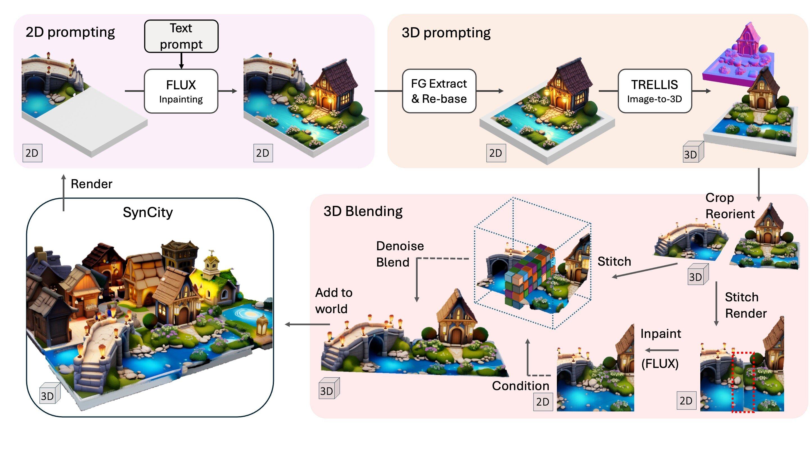

# SynCity: Training-Free Generation of 3D Worlds
[Paul Engstler](https://www.paulengstler.com)\*, [Aleksandar Shtedritski](https://suny-sht.github.io)\*, [Iro Laina](https://eng.ox.ac.uk/people/iro-laina/), [Christian Rupprecht](https://chrirupp.github.io/), [Andrea Vedaldi](https://www.robots.ox.ac.uk/~vedaldi/)<br>
Visual Geometry Group, University of Oxford (* denotes equal contribution)
<br><br>
<a href="https://arxiv.org/abs/2503.16420"></a>
<a href="https://research.paulengstler.com/syncity"></a><br>



SynCity generates complex and immersive 3D worlds from text prompts and does not require any training or optimization. It leverages the pretrained 2D image generator Flux (for artistic diversity and contextual coherence) and the 3D generator TRELLIS (for accurate geometry). We incrementally build scenes on a grid in a tile-by-tile fashion: First, we generate each tile as a 2D image, where context from adjacent tiles establishes consistency. Then, we convert the tile into a 3D model. Finally, adjacent tiles are blended seamlessly into a coherent, navigable 3D environment.

## 📦 Installation

### Prerequisites
* **System**: The code was tested on Ubuntu 22.04. We expect it to run on other Linux-based distributions too.
* **Hardware**: An NVIDIA GPU with at least **48GB** of memory is required. We have used A40 and A6000 GPUs.
* **Software**:
    - The [CUDA Toolkit](https://developer.nvidia.com/cuda-toolkit-archive) is needed to compile certain submodules. We have tested CUDA versions 11.8 and 12.4.
    - [Conda](https://docs.anaconda.com/miniconda/install/#quick-command-line-install) is used to create the environment to run the code. This environment uses Python version 3.10.
    - [Blender 3.6.19](https://www.blender.org/download/release/Blender3.6/blender-3.6.19-linux-x64.tar.xz) is required as part of the pipeline.

### Installation Steps

1. Clone the repository:
```
git clone --recurse-submodules https://github.com/paulengstler/syncity.git
cd syncity
```

2. Install the dependencies:
```
source ./setup.sh --new-env --basic --xformers --diffoctreerast --spconv --mipgaussian --kaolin --nvdiffrast
```
Make sure to have set the environment variable `CUDA_HOME`, which should point to your CUDA Toolkit installation. If you run into issues while running this setup script, please refer to [the README in the TRELLIS](https://github.com/microsoft/TRELLIS/blob/main/README.md#installation-steps) repository, which provides additional guidance.

3. Set up the FLUX inpainting server:
```
./inpainting_server.sh --install
```

4. Download [Blender 3.6.19](https://www.blender.org/download/release/Blender3.6/blender-3.6.19-linux-x64.tar.xz), extract it into the root directory of this project, and make sure `blender-3.6.19-linux-x64/blender` can be executed on your system.

5. Create a [HuggingFace](https://huggingface.co) account if you do not already have one. Then, agree to the terms & conditions of [black-forest-labs/FLUX.1-dev](https://huggingface.co/black-forest-labs/FLUX.1-dev). Run `huggingface-cli login` and follow the instructions.

## ⚙️ Usage

Make sure to have activated the `syncity` Conda environment. To run the world generation pipeline, at least one inpainting server needs to be available. To start a server, run `./inpainting_server.sh --run`. The script will provide you with a *local URL* (e.g., `http://127.0.0.1:7860`), which is later passed as an argument to the pipeline. Be sure to save it for later use.

The process to generate a world is split into two straightforward steps.

### Step 1: Generating Tiles
The tiles are generated using an instruction file, which contain the prompts to generate each tile (see some examples in the `instructions` folder). To generate a set of tiles that will be saved to `scenes/solarpunk`, run:
```
python run_pipeline.py --instructions instructions/3x3/solarpunk.json --prefix scenes/solarpunk --gradio_url=http://127.0.0.1:7860
```

This script will parallelize tile generation where possible if multiple GPUs are available. If the script is stalling for longer than a minute, consider running the tile generation synchronously (`--parallel=False`). Furthermore, if a single tile keeps being regenerated, consider interrupting the script and replacing the offending tile's prompt. Then, restart the script with `--skip_existing=True` to ensure it will not overwrite existing tiles. Alternatively, see the ["Advanced Usage"](#advanced_usage) section on how to adjust the tile rejection criteria.

### Step 2: Blending Tiles
To create smooth transitions between tiles and refine their boundary regions, run the blending script:
```
python blend_gaussians.py --compute_rescaled --stitch_images --stitch_slats --gradio_url=http://127.0.0.1:7860 --prefix scenes/solarpunk
```

This script will create a `.ply` file with the Gaussians of the entire grid as well as a video rendering.

### Creating Instructions

If you want to generate your own set of instructions to create a grid, there are two approaches you can take:

1. **Query a large language model**: For the results in our paper, we have relied on OpenAI's ChatGPT o3-mini-high. We expect other modern reasoning models to work equally well. The initial prompt we used to explain the task to the model can be found in `instructions/prompt.txt`. Consider tweaking the tile prompts generated by your model of choice based on our tips below. This is an optional step but might improve the quality of the generated grid.

2. **Unleash your own creativity**: As the instructions are simple JSON files, you can simply take an existing instruction file in the `instructions` folder and adapt it to your vision. As we use a different seed for each tile, you can repeat a prompt and obtain a different result. Consider our tips below for high quality results.

We are excited to see the amazing grids you will build. Please share them with us!

In our own experiments, we have found that some types of prompts work better than others. We want to share our insights here, but we acknowledge that this list is by no means exhaustive.

* **Use open-space tile prompts**. Free-standing buildings and objects are preferable to room-like prompts, which encourage walls at the edges of a tile.
    - ✅ A restaurant with generous outdoor seating
    - ❌ A large room inside a restaurant with a long table in the center
    - ❌ A terrace of a restaurant with tables scattered throughout

* **Design flat worlds**. While the elevation may be dynamic in a single tile, our method might struggle to carry changes in elevation across tiles.
    - ✅ An English oak on top of a small hill, with a fantastic fox next to it
    - ❌ Mountains in the Lake District with Herdwick sheep

* **Keep multi-tile continuity at ground level**. Structures that span multiple tiles can be easily generated. However, they tend to work best when roughly at ground level.
    - ✅ A house with a river flowing in front of it
    - ❌ A part of a roller coaster with vertical loops

* **Experiment with density**. While tiles can house individual objects or buildings, they also support highly complex layouts.
    - 1️⃣ A café surrounded by lots of green
    - 🔢 A suburban scene with lots of green, cafés, restaurants and boutiques, some cars

<a id="advanced_usage"></a>
### Advanced Usage

- If you would like to replace a tile in the final grid (e.g., the tile at coordinate `(2,1)`), you may resample it. Remember that you will need to re-run the blending step (you may replace multiple tiles at the same time).

```
python run_pipeline.py --instructions instructions/3x3/solarpunk.json --prefix scenes/solarpunk --gradio_urls=http://127.0.0.1:7860 --resample=2,1 --resample_prompt="an alternative tile prompt" --seed=123
```

- In case you want to remove any redundant Gaussians below surface level, we provide this small script to accomplish that. You may find that you need to manually adjust the offset (to account for structures below surface level, such as water).

```python
import os
import imageio
from trellis.representations.gaussian import Gaussian
from trellis.utils import render_utils

def slice_gaussians(prefix):
    g = Gaussian(aabb=[-1, -1, -1, 1, 1, 1])
    g.load_ply(os.path.join(prefix, "gaussians_scene.ply"), transform=None)

    Z_OFFSET, SLAB_HEIGHT = 0.15, 0.1

    # TODO adjust if necessary. negative values lower the surface level.
    offset = 0.0

    surface_level_mask = g.get_xyz[:, 2] > (-(0.5 - Z_OFFSET) + SLAB_HEIGHT + offset)

    g._xyz = g._xyz[surface_level_mask]
    g._scaling = g._scaling[surface_level_mask]
    g._opacity = g._opacity[surface_level_mask]
    g._rotation = g._rotation[surface_level_mask]
    g._features_dc = g._features_dc[surface_level_mask]

    g.save_ply(os.path.join(prefix, "gaussians_scene_sliced.ply"), transform=None)

    x_extent = g.get_xyz[:, 0].max() - g.get_xyz[:, 0].min()
    y_extent = g.get_xyz[:, 1].max() - g.get_xyz[:, 1].min()

    max_extent = max(x_extent, y_extent)

    video = render_utils.render_video(g, num_frames=300, resolution=2048, r=int(max_extent*2.5), pitch_mean=0.3, pitch_offset=0.15, bg_color=(1,1,1))['color']
    imageio.mimsave(os.path.join(prefix, "gaussians_blended_sliced.mp4"), video, fps=30)

if __name__ == "__main__":
    import fire
    fire.Fire(slice_gaussians)
```

- You may tune several hyperparameters that we have used:

    * We reject generated tiles if they do not satisfy certain criteria. These are set in `run_pipeline.run_trellis` as a default argument. Please refer to the paper for an explanation of each metric. While setting `slab_size` to values less than `64*64` might lead to fewer tile rejections, the scaling might not yield visually pleasing results (especially for values `<1024`).

    * We add a very small overlap region that extends into existing tiles in the inpainting mask. This allows us to tolerate minor defects at boundary regions during tile generation. We set this value in `run_pipeline.inpaint_tile`.

    * When rebasing, we scale the newly generated tile down and place it in the center of the square slab. By default, we use a scale of 85%. Using a lower value encourages TRELLIS to generate square tiles, at the cost of visual quality. The scale can be controlled by adding this flag to the first step: `--rebasing_scale=0.85`

- To speed up generation or generate larger grids, you may use a larger GPU or run the inpainting server on a different machine. You can accommodate this change with only minor modifications to the code. We offload Flux to the CPU when unused and reload TRELLIS in each generation step to manage the GPU memory budget.


## 💐 Acknowledgements

We thank the authors of [TRELLIS](https://github.com/microsoft/TRELLIS), [Flux](https://github.com/black-forest-labs/flux), and [3D Gaussian Splatting](https://github.com/graphdeco-inria/gaussian-splatting) as well as the contributors to the [Blender](https://www.blender.org) project. Without these projects, SynCity would not have been possible.

The authors of this work are supported by ERC 101001212-UNION, AIMS EP/S024050/1, and Meta Research.

## 📜 Citation

If you find this work helpful, please consider citing our paper:

```bibtex
@inproceedings{
    engstler2025syncity,
    title={SynCity: Training-Free Generation of 3D Worlds}
    author={Paul Engstler and Aleksandar Shtedritski and Iro Laina and Christian Rupprecht and Andrea Vedaldi}
    year={2025}
    booktitle={Arxiv}
}
```


